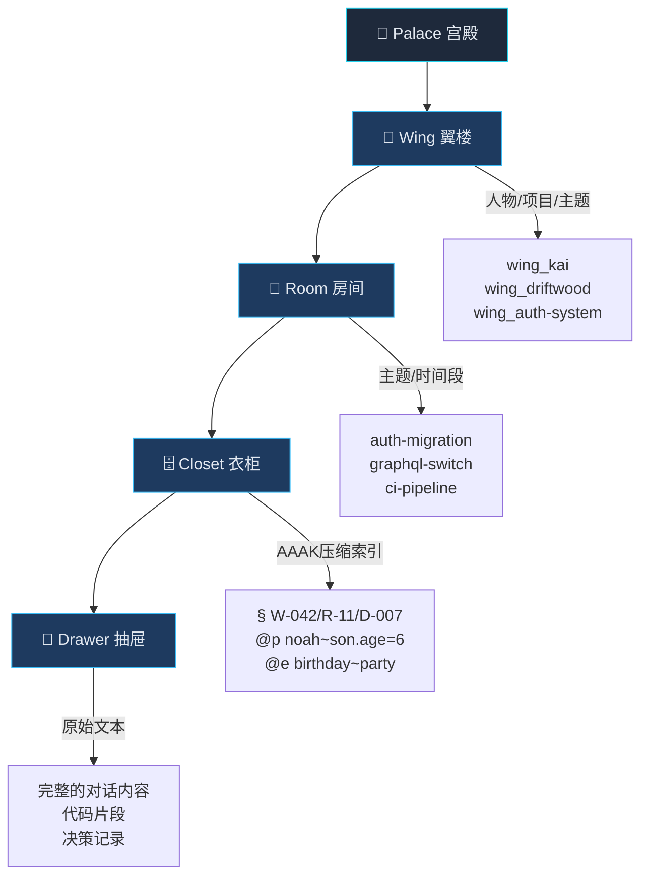
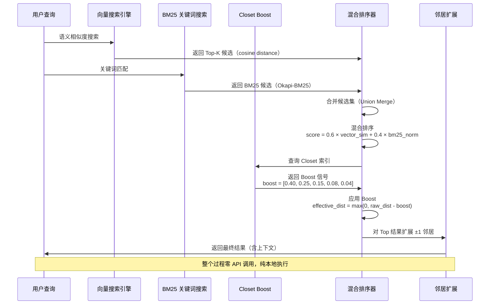
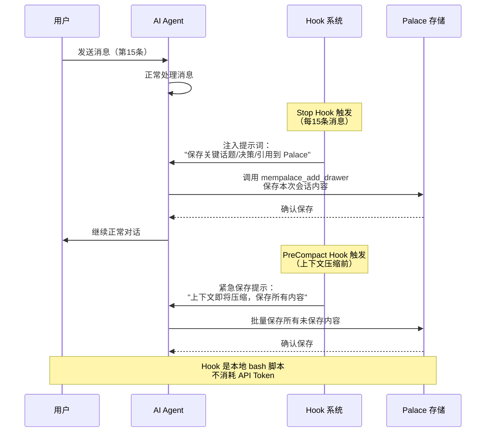

---
categories:
- AI
date: 2026-05-17
description: "深度剖析 MemPalace——一个用'宫殿隐喻'重构 AI 记忆系统的开源项目。从架构设计到混合搜索算法，从 MCP 工具生态到实际应用场景，全面解读为什么'存原始文本'比'LLM 提取'更强。"
image: /images/cover-ai.svg
lastmod: 2026-05-17
slug: mempalace-ai-memory-deep-dive
tags:
- AI Agent
- 记忆系统
- RAG
- 向量数据库
- MCP
- ChromaDB
title: "AI Agent 的记忆革命：MemPalace 如何用'宫殿隐喻'重构 LLM 记忆"
---

## 金鱼记忆的 AI Agent

用 AI Agent 写代码的人，大概都有过这样的时刻：

你花了三个小时跟 Agent 讨论架构方案，做了十几轮代码迭代，终于把认证模块从 OAuth 1.0 迁移到 OAuth 2.0。第二天打开新会话，Agent 一脸茫然："请问您想实现什么功能？"

三个小时的上下文，就这么蒸发了。

这不是 Agent 笨——这是**记忆系统**的根本性缺陷。当前所有主流方案（Mem0、Mastra、Supermemory）都在做同一件事：**用 LLM 决定记什么**。它们提取事实、生成摘要、压缩上下文，然后把原始对话丢进垃圾桶。

问题在于：当 LLM 提取出"用户喜欢 PostgreSQL"并丢弃原始对话时，它丢失了**为什么**喜欢、考虑过哪些替代方案、讨论了哪些权衡。

MemPalace 说：**别提取了，把原文存下来。**

这个反直觉的方案，在 LongMemEval 基准上跑出了 **96.6% 的检索召回率**——不需要任何 API，不需要云端，不需要 LLM。

---

## 一、MemPalace：不只是另一个 RAG

### 1.1 核心理念

MemPalace 的设计哲学可以用一句话概括：

> **原始文本 > LLM 提取。简单的事情做对了，比复杂的事情做错了更好。**

| 维度 | 传统方案（Mem0 等） | MemPalace |
|------|-------------------|-----------|
| 存储内容 | LLM 提取的事实/摘要 | 原始对话文本（verbatim） |
| 信息损耗 | 高（提取过程丢失上下文） | 零（原文存储） |
| 检索方式 | 向量语义搜索 | BM25 + 向量 + Closet Boost 混合搜索 |
| LLM 依赖 | 必须（提取和检索都需要） | 可选（核心路径零 API） |
| 隐私性 | 数据通常上传云端 | 本地优先，数据不出机器 |

### 1.2 灵感来源

MemPalace 的架构灵感来自两个经典方法论：

**卢曼卡片笔记法（Zettelkasten）**：德国社会学家尼克拉斯·卢曼用小的、交叉引用的索引卡片管理知识。每张卡片是一个原子想法，通过链接形成知识网络。

**古希腊记忆宫殿法（Method of Loci）**：把需要记忆的内容"放置"在想象中的空间位置，通过"行走"回忆。MemPalace 的 Wings、Rooms、Drawers 就是这个隐喻的代码实现。

---

## 二、宫殿架构：四层结构深度剖析

MemPalace 的核心是一个**四层递进的存储结构**：



### 2.1 Wing（翼楼）—— 顶层组织单元

每个 Wing 代表一个**实体**：一个人、一个项目、或一个主题。

```
wing_kai           → 某个人的所有对话
wing_driftwood     → 某个项目的所有记录
wing_auth-system   → 认证系统相关的所有内容
```

**设计意图**：当搜索"Kai 的认证方案"时，可以限定在 `wing_kai` 范围内搜索，避免其他项目的噪音干扰。

### 2.2 Room（房间）—— 主题分组

每个 Wing 下有多个 Room，代表**具体主题或时间段**：

```
wing_kai/
  ├── room_auth-migration    → OAuth 迁移相关
  ├── room_graphql-switch    → GraphQL 切换相关
  └── room_ci-pipeline       → CI 流水线相关
```

Room 通常从文件夹结构自动检测，也可以手动创建。

### 2.3 Closet（衣柜）—— AAAK 压缩索引

这是 MemPalace 最精妙的设计。Closet 是一个**压缩的索引层**，用一种叫 AAAK 的密集符号语言编写，LLM 可以一眼扫描数千条索引，精确定位到需要的 Drawer。

```yaml
§ W-042/R-11/D-007          # 定位符：翼楼-042/房间-11/抽屉-007
@p noah~son.age=6~dob=09-12 # 人物：Noah，儿子6岁，生日9月12日
@l glebe-pt-rd.park          # 地点：Glebe Point Road 公园
@e birthday~party(n≈8)       # 事件：生日派对，约8人
@i therizinosaurus~claws     # 兴趣：镰刀龙的爪子
@t 2026-04-14T09:41          # 时间戳
§ ptr → D-007 (verbatim)     # 指针：指向抽屉-007的原始文本
```

**为什么需要 Closet？**

直接搜索所有 Drawer 效率太低。Closet 就像图书馆的目录卡片——先看目录，再去找书。LLM 扫描 Closet 可以瞬间知道"关于 Noah 生日的信息在 D-007"，然后直接读取那个 Drawer 的完整内容。

### 2.4 Drawer（抽屉）—— 原始文本存储

最底层，存储**原始对话的完整文本**。不做任何摘要、压缩或改写。

```
Drawer D-007:
  "Noah's birthday party was at the park on Glebe Point Road.
   About 8 kids came. He was really into therizinosaurus claws
   at the time, so the cake had a dinosaur theme..."
```

### 2.5 Hall（大厅）—— 概念分类

每个 Wing 内还有隐含的 **Hall** 分类：

| Hall | 内容 |
|------|------|
| `hall_facts` | 做出的决定、锁定的选择 |
| `hall_events` | 会话、里程碑、调试过程 |
| `hall_discoveries` | 突破、新洞察 |
| `hall_preferences` | 习惯、偏好、观点 |
| `hall_advice` | 建议和解决方案 |

### 2.6 Tunnel（隧道）—— 跨翼楼连接

当两个 Wing 有相同的 Room 名称时，自动建立 **Tunnel** 连接：

```
wing_kai       / hall_events / auth-migration  → "Kai 调试了 OAuth token refresh"
wing_driftwood / hall_facts  / auth-migration  → "团队决定迁移到 Clerk"
wing_priya     / hall_advice / auth-migration  → "Priya 批准了 Clerk 而非 Auth0"
```

搜索"auth-migration"时，可以通过 Tunnel 找到所有相关 Wing 的内容。

---

## 三、核心实现原理

### 3.1 混合搜索算法

MemPalace 的搜索不是简单的向量检索，而是一个**三阶段混合管道**：



#### BM25 实现细节

MemPalace 使用 **Okapi-BM25** 算法，参数经过精心调优：

```python
# BM25 参数
k1 = 1.5    # 词频饱和度（term-frequency saturation）
b = 0.75    # 长度归一化（length normalization）

# IDF 计算：使用 Lucene/BM25+ 平滑公式
# 避免除零错误，对罕见词给予更高权重
idf = log(1 + (N - n + 0.5) / (n + 0.5))

# 最终分数归一化到 [0, 1]，与向量分数可比较
bm25_norm = (score - min_score) / (max_score - min_score)
```

#### Closet Boost 机制

Closet 不是搜索的"门"，而是"助推器"：

```python
CLOSET_RANK_BOOSTS = [0.40, 0.25, 0.15, 0.08, 0.04]  # 基于排名的 Boost
CLOSET_DISTANCE_CAP = 1.5  # 距离 > 1.5 的 Closet 信号太弱，忽略

# 有效距离 = max(0, min(2, 原始距离 - boost))
# 效果：匹配 Closet 的 Drawer 被拉到更前面
```

**关键设计决策**：Closet 只是排序信号，不是过滤器。即使 Closet 没命中，直接搜索 Drawer 也能找到结果。这避免了"Closet 质量差导致搜不到"的问题。

#### 邻居扩展

当找到一个匹配的 Drawer 时，自动扩展其**前后各 1 个 Drawer**：

```python
def expand_with_neighbors(drawers_col, matched_doc, matched_meta, radius=1):
    """扩展匹配的 Drawer，包含 ±radius 的兄弟块。"""
    # 解决"对话被切断"的问题
    # 例如：Drawer 5 讨论了方案 A，Drawer 6 讨论了方案 B
    # 搜索"方案 A"时，返回 Drawer 5 + 6，提供完整上下文
```

#### BM25-Only 降级方案

当 HNSW 索引损坏时，自动降级到纯 BM25 搜索：

```python
def bm25_only_via_sqlite(query, palace_path, ...):
    """BM25-only 搜索，直接从 chroma.sqlite3 读取。"""
    # 绕过 ChromaDB 的 Python 客户端
    # 使用 ChromaDB 内部的 FTS5 三元组索引
    # 当 HNSW 段损坏或不可加载时自动触发
```

### 3.2 知识图谱：时间感知的实体关系

MemPalace 内置了一个**时间感知的实体关系图谱**，用 SQLite 实现（不是 Neo4j）：

```sql
-- 实体表
CREATE TABLE entities (
    id TEXT PRIMARY KEY,          -- 规范化名称（小写，下划线）
    name TEXT NOT NULL,           -- 原始名称
    type TEXT DEFAULT 'unknown',  -- person, project, tool, concept
    properties TEXT DEFAULT '{}', -- JSON 元数据
    created_at TEXT DEFAULT CURRENT_TIMESTAMP
);

-- 关系三元组表
CREATE TABLE triples (
    id TEXT PRIMARY KEY,
    subject TEXT NOT NULL,        -- FK → entities.id
    predicate TEXT NOT NULL,      -- 关系类型
    object TEXT NOT NULL,         -- FK → entities.id
    valid_from TEXT,              -- 生效时间
    valid_to TEXT,                -- 失效时间（NULL = 仍有效）
    confidence REAL DEFAULT 1.0,  -- 置信度
    source_closet TEXT,           -- 链接到原始记忆
    source_drawer_id TEXT         -- 溯源信息
);
```

**使用示例**：

```python
from mempalace.knowledge_graph import KnowledgeGraph

kg = KnowledgeGraph()

# 添加事实（带时间窗口）
kg.add_triple("Kai", "works_on", "Orion", valid_from="2025-06-01")
kg.add_triple("Maya", "assigned_to", "auth-migration", valid_from="2026-01-15")

# 查询：Kai 的所有关系
kg.query_entity("Kai")

# 时间旅行查询：2026年1月的事实
kg.query_entity("Maya", as_of="2026-01-20")

# 时间线：Orion 项目的历史
kg.timeline("Orion")

# 失效旧事实
kg.invalidate("Kai", "works_on", "Orion", ended="2026-03-01")
```

### 3.3 Hook 系统：零 Token 的自动保存

MemPalace 的 Hook 系统是**零 Token 消耗**的自动保存机制：



**Hook 配置**：

在 `.claude/settings.local.json` 中配置（详见第六章安装指南）。

**性能指标**：
- Stop Hook 执行时间：< 500ms
- PreCompact Hook 执行时间：< 500ms
- 启动注入（wake-up）：< 100ms
- 测试规模：150K+ Drawers

---

## 四、MCP 工具生态：30 个工具全景

MemPalace 通过 MCP（Model Context Protocol）暴露了 **30 个工具**，覆盖记忆系统的完整生命周期：

### 4.1 读取工具（7 个）

| 工具 | 功能 |
|------|------|
| `mempalace_status` | 宫殿概览：总 Drawer 数、Wing/Room 计数、AAAK 规范 |
| `mempalace_list_wings` | 列出所有 Wing 及其 Drawer 数量 |
| `mempalace_list_rooms` | 列出指定 Wing 下的 Room |
| `mempalace_get_taxonomy` | 完整的 Wing → Room → Drawer 数量树 |
| `mempalace_search` | **语义搜索**：返回原始 Drawer 内容 + 相似度分数 |
| `mempalace_check_duplicate` | 检查内容是否已存在（阈值 0.85-0.87） |
| `mempalace_get_aaak_spec` | 返回 AAAK 索引规范 |

### 4.2 写入工具（6 个）

| 工具 | 功能 |
|------|------|
| `mempalace_add_drawer` | 将原始内容存入 Palace |
| `mempalace_delete_drawer` | 删除 Drawer（不可逆） |
| `mempalace_sync` | 清理已删除/移动的源文件对应的 Drawer |
| `mempalace_get_drawer` | 获取单个 Drawer 的完整内容 |
| `mempalace_list_drawers` | 分页列出 Drawer |
| `mempalace_update_drawer` | 更新 Drawer 内容/元数据 |

### 4.3 知识图谱工具（5 个）

| 工具 | 功能 |
|------|------|
| `mempalace_kg_query` | 查询实体关系（支持时间过滤） |
| `mempalace_kg_add` | 添加事实三元组 |
| `mempalace_kg_invalidate` | 标记事实失效 |
| `mempalace_kg_timeline` | 实体的时间线 |
| `mempalace_kg_stats` | 图谱概览 |

### 4.4 导航工具（7 个）

| 工具 | 功能 |
|------|------|
| `mempalace_traverse` | 从某个 Room 开始遍历，找到跨 Wing 的关联内容 |
| `mempalace_find_tunnels` | 找到连接两个 Wing 的 Tunnel |
| `mempalace_graph_stats` | 宫殿图概览：节点、隧道、边、连通性 |
| `mempalace_create_tunnel` | 创建跨 Wing 的 Tunnel |
| `mempalace_list_tunnels` | 列出所有 Tunnel |
| `mempalace_delete_tunnel` | 删除 Tunnel |
| `mempalace_follow_tunnels` | 跟踪 Tunnel 到达其他 Wing |

### 4.5 Agent 日记工具（2 个）

| 工具 | 功能 |
|------|------|
| `mempalace_diary_write` | 写入 Agent 个人日记 |
| `mempalace_diary_read` | 读取最近的日记条目 |

### 4.6 系统工具（3 个）

| 工具 | 功能 |
|------|------|
| `mempalace_hook_settings` | 获取/设置自动保存 Hook 行为 |
| `mempalace_memories_filed_away` | 检查最近的 Palace 检查点是否已保存 |
| `mempalace_reconnect` | 强制重连 Palace 数据库 |

---

## 五、性能基准：96.6% 的真实含义

### 5.1 LongMemEval 结果

| 模式 | R@5 | 是否需要 LLM | 成本 |
|------|:---:|:---:|:---:|
| **Raw（纯语义搜索）** | **96.6%** | ❌ | $0 |
| **Hybrid v4（held-out 450题）** | **98.4%** | ❌ | $0 |
| **Hybrid v4 + Haiku rerank** | **100%** | ✅ Haiku | ~$0.001/次 |
| **Hybrid v4 + Sonnet rerank** | **100%** | ✅ Sonnet | ~$0.003/次 |

**重要说明**：
- 96.6% 是**检索召回率**（R@5），不是 QA 准确率
- 100% 的最后 0.6% 是通过检查 3 个特定错误答案达到的（属于"教学生应付考试"）
- 诚实的泛化数字是 held-out 450 题的 98.4%

### 5.2 与其他系统对比

| 系统 | 分数 | 指标类型 | 说明 |
|------|:---:|:---:|------|
| **MemPalace (raw)** | **96.6%** | R@5 召回率 | 零 API，纯本地 |
| Mastra | 94.87% | QA 准确率 | 不同指标，不可直接比较 |
| Supermemory ASMR | ~99% | QA 准确率 | 实验性，8-12 Agent 集成 |
| Hindsight | 91.4% | 未验证 | 需要检查方法论 |
| Mem0 | ~66.9% | QA 准确率（LoCoMo） | 不同基准 |

**关键洞察**：Mem0 在 ConvoMem 基准上只有 30-45%，而 MemPalace 是 92.9%——**2 倍以上的差距**。原因是 Mem0 用 LLM 提取记忆，提取错了记忆就丢了；MemPalace 存原始文本，什么都不丢。

### 5.3 社区争议

Hacker News 上对 MemPalace 的基准分数有质疑：

1. **100% 分数被揭穿**：GitHub issues #27、#29、#39、#125、#242 有详细的揭穿记录
2. **LoCoMo 100% 有问题**：使用 top-k=50 超过了会话数量；诚实的 top-10 无 rerank 是 88.9%
3. **名人效应**：作者是演员 Milla Jovovich，带来了关注度但也带来了质疑
4. **安全警告**：相关域名被发现传播恶意软件（GitHub issue #326）

**客观来看**：基准分数有水分，但核心理念（原始文本 > LLM 提取）是成立的。96.6% 的 raw 分数仍然很亮眼——不需要任何 API 就能达到这个水平，说明"简单的事情做对了"这个思路是对的。

---

## 六、安装与使用指南

### 6.1 安装

推荐使用 `uv` 安装（Python 包管理器）：

```bash
# 安装 uv（如果没有）
curl -LsSf https://astral.sh/uv/install.sh | sh

# 安装 MemPalace
uv tool install mempalace

# 或者用 pip
pip install mempalace
```

安装完成后，`mempalace` CLI 就可以直接使用了。

### 6.2 初始化与挖掘

```bash
# 初始化项目记忆（交互式，会自动检测实体）
mempalace init ~/projects/myapp

# 非交互式初始化（适合脚本）
mempalace init --yes ~/projects/myapp

# 挖掘项目文件
mempalace mine ~/projects/myapp

# 挖掘 Claude Code 会话历史
mempalace mine ~/.claude/projects/ --mode convos

# 挖掘时指定 Wing（按项目分组）
mempalace mine ~/.claude/projects/myapp --mode convos --wing myapp
```

### 6.3 搜索模式

MemPalace 提供三种搜索模式，按需选择：

| 模式 | 命令 | 特点 |
|------|------|------|
| **Raw（默认）** | `mempalace search "查询内容"` | 纯向量语义搜索，零 API，96.6% R@5 |
| **Hybrid** | `mempalace search --mode hybrid "查询内容"` | BM25 + 向量混合搜索，98.4% R@5 |
| **Hybrid + Rerank** | `mempalace search --mode hybrid --llm-rerank "查询内容"` | 混合搜索 + LLM 重排，≥99% R@5 |

```bash
# 基础语义搜索
mempalace search "为什么选择 GraphQL 而不是 REST"

# 混合搜索（推荐，效果最好）
mempalace search --mode hybrid "OAuth 迁移遇到的问题"

# 限定 Wing 范围搜索
mempalace search --wing myapp "认证方案设计"

# 限定 Room 范围搜索
mempalace search --wing myapp --room auth-migration "token 刷新逻辑"
```

### 6.4 配置 Claude Code Hook

在项目的 `.claude/settings.local.json` 中添加 Hook，实现自动保存：

```json
{
  "hooks": {
    "Stop": [{
      "matcher": "",
      "hooks": [{
        "type": "command",
        "command": "mempalace-hook-stop"
      }]
    }],
    "PreCompact": [{
      "matcher": "",
      "hooks": [{
        "type": "command",
        "command": "mempalace-hook-precompact"
      }]
    }]
  }
}
```

- **Stop Hook**：每 15 条用户消息自动触发，保存关键内容
- **PreCompact Hook**：上下文压缩前紧急保存，防止记忆丢失

### 6.5 唤醒上下文

在新会话开始前，用 `wake-up` 注入历史记忆：

```bash
# 自动注入相关历史上下文
mempalace wake-up
```

执行后，Agent 会自动获得最近的项目记忆，不再"失忆"。

### 6.6 知识图谱操作

```bash
# 查看知识图谱统计
mempalace kg stats

# 通过 Python API 操作
python3 -c "
from mempalace.knowledge_graph import KnowledgeGraph
kg = KnowledgeGraph()
kg.add_triple('Kai', 'works_on', 'Orion', valid_from='2025-06-01')
print(kg.query_entity('Kai'))
"
```

---

## 七、实际应用场景

### 7.1 代码开发：跨会话的项目记忆

**效果**：Agent 可以回忆起三个月前讨论的技术选型理由、考虑过的替代方案、以及最终决策的上下文。

### 7.2 知识管理：个人知识图谱

用知识图谱记录学到的知识和关系，支持时间旅行查询——"这个知识是怎么积累的"。

### 7.3 团队协作：共享记忆库

每个团队成员有自己的 Wing，通过 Tunnel 连接相关工作。搜索时可以跨 Wing 找到所有相关内容。

### 7.4 私有化部署：数据不出机器

MemPalace 的**本地优先**设计特别适合私有化场景：

- 所有数据存储在本地 SQLite + ChromaDB
- 核心路径零 API 调用
- 可选的 LLM rerank 可以用本地模型（Ollama）
- 适合对数据安全要求高的企业环境

---

## 八、启发与未来展望

### 8.1 AI 记忆系统的设计思路

MemPalace 给我们最大的启发是：

> **不要让 AI 决定记什么。存原始文本，让搜索算法决定找什么。**

这个思路可以应用到很多场景：
- **代码审查记录**：存完整的 diff 和讨论，而不是摘要
- **需求文档**：存原始的用户对话，而不是需求分析师的理解
- **故障排查**：存完整的日志和排查过程，而不是事后总结
- **会议记录**：存原始的发言内容，而不是会议纪要

简单的事情做对了，比复杂的事情做错了更好——这个工程哲学值得每一个系统设计者铭记。

### 8.2 从搜索到记忆组织

MemPalace 的四层结构（Wing → Room → Closet → Drawer）暗示了一个更大的趋势：

> **AI 需要的不是更好的搜索，而是更好的记忆组织。**

当前的 RAG 系统大多是"扁平"的——所有文档扔进一个向量库，搜索时暴力匹配。MemPalace 的分层结构让搜索可以**限定范围**，就像在图书馆里先找到对应楼层、对应书架，再找具体那本书。

未来的记忆系统可能会：
- 自动学习用户的记忆模式（哪些信息关联在一起）
- 主动推送相关记忆（"你三个月前讨论过类似的问题"）
- 支持记忆的"遗忘"（过时信息自动降权）

### 8.3 记忆系统的标准化

当前 AI 记忆系统处于"战国时代"——每个项目都有自己的架构和接口。未来可能会出现：

- **统一的记忆协议**（类似 MCP 之于工具调用）
- **可互操作的记忆后端**（MemPalace 的可插拔后端是好的开始）
- **记忆交换格式**（让不同 Agent 共享记忆）

### 8.4 记忆的隐私与所有权

MemPalace 的本地优先设计提出了一个重要问题：

> **AI 的记忆应该归谁所有？**

- 用户的对话记忆应该存储在用户控制的地方
- 企业内部的知识记忆应该有访问控制
- 记忆的"删除权"应该被尊重

这不仅是技术问题，更是产品伦理问题。当 AI 越来越了解我们，谁拥有这些"了解"，将成为一个绕不开的议题。

---

## 参考资料

1. **MemPalace GitHub**: https://github.com/MemPalace/mempalace
2. **官方文档**: https://mempalaceofficial.com
3. **LongMemEval 基准**: https://github.com/MemPalace/mempalace/tree/main/benchmarks
4. **Hacker News 讨论**: https://news.ycombinator.com/item?id=43554262
5. **Mem0 Research**: https://mem0.ai/research
6. **Mastra Observational Memory**: https://mastra.ai/research/observational-memory
7. **卢曼卡片笔记法**: https://zettelkasten.de/

---

*本文基于 MemPalace v3.3.5（2026-05-09）版本分析。项目仍在活跃开发中，部分细节可能随版本更新而变化。*
