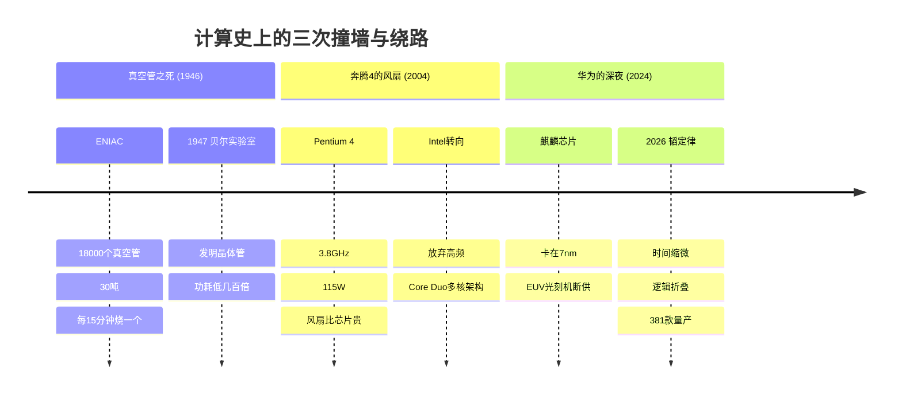
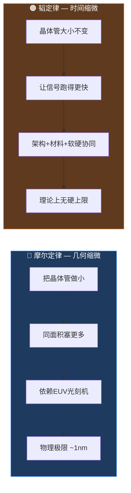
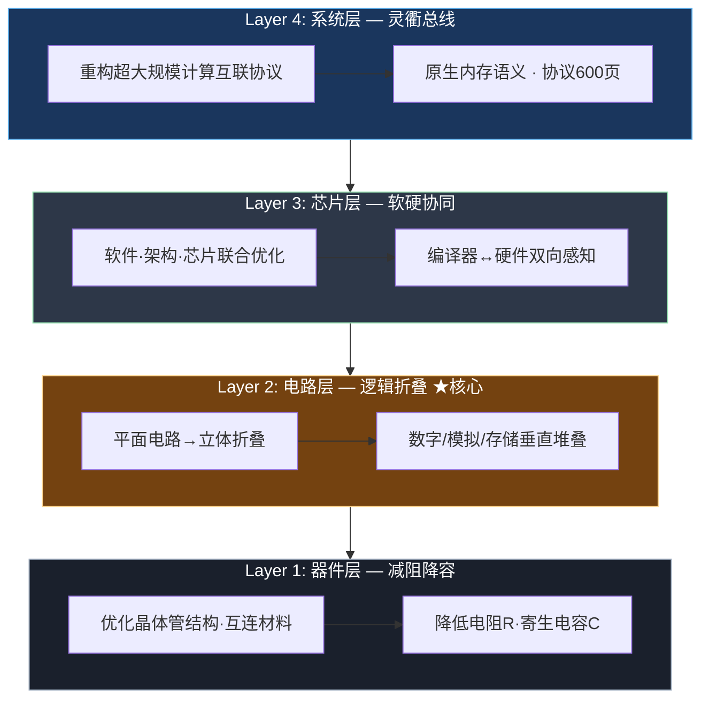
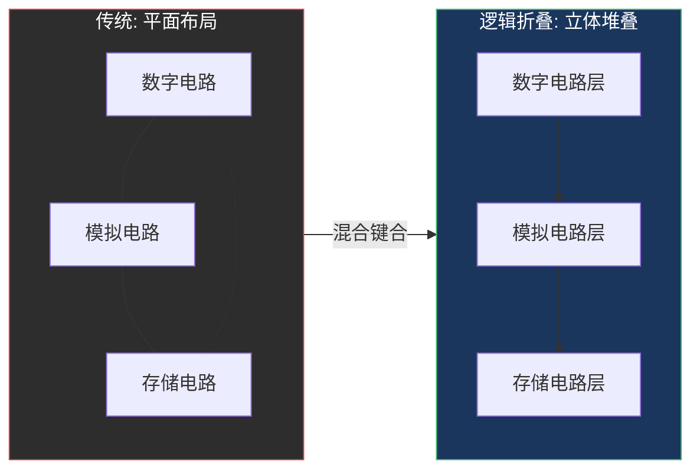
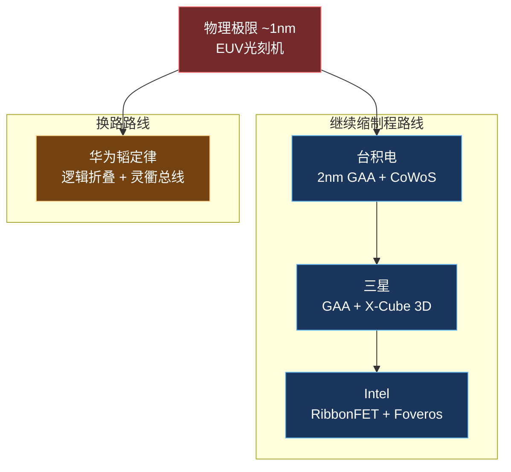
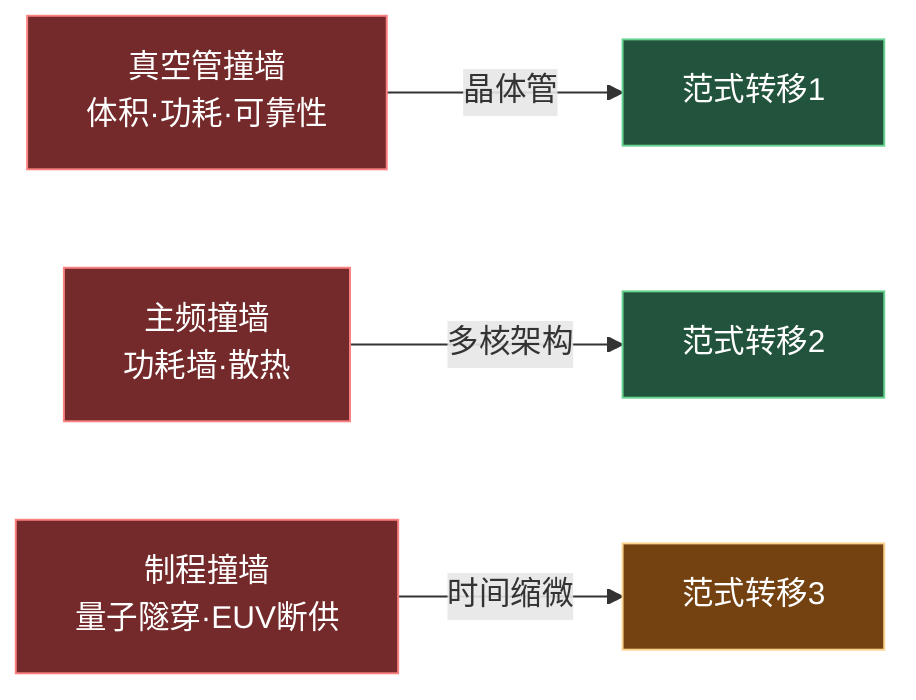

---
categories:
- AI
date: 2026-05-26
description: 当晶体管不能再缩小，算力从哪里来？华为韬(τ)定律给出了一条新路——用时间缩微替代几何缩微。从五十年计算史的三次撞墙出发，拆解这条可能改写芯片格局的新路径。
image: /images/cover-ai.svg
lastmod: 2026-05-26
slug: from-moore-to-tao
tags:
- 半导体
- 华为
- 韬定律
- 摩尔定律
- 芯片
title: 当晶体管不能再缩小——从摩尔定律到韬定律的五十年算力突围
---

# 当晶体管不能再缩小——从摩尔定律到韬定律的五十年算力突围

> 每次有人说"这条路到头了"，就有人证明：路不止一条。

2026年5月25日，上海。IEEE国际电路与系统研讨会（ISCAS）的舞台上，华为何庭波说了一个希腊字母：τ（tau）。

两天后，这个字母刷屏了整个科技圈。有人说是重大突破，有人说是营销造词。这篇文章不站队，只做一件事：**从五十年计算史的三次撞墙出发，把韬定律拆给你看。**

---

## 三个故事：计算史上的三次撞墙

━━━━━━━━━━━━━━━━━━━━━━━━━━━━━━━━━━━━━━━━━━━━━━

### 故事一：真空管之死（1946）

1946年，费城。ENIAC开机的瞬间，18000个真空管同时亮起，整栋楼的灯都暗了一下。

这台人类第一台通用电子计算机重30吨，占地170平方米，每15分钟就有一个真空管烧坏。工程师们蹲在地上，像换灯泡一样一个个替换。有人问了一个问题：**这条路能走多远？**

答案是：走不远。真空管的体积、功耗、可靠性，每一条都是死胡同。

1947年，贝尔实验室的三个物理学家发明了晶体管。一个拇指甲大小的固体器件，干了真空管的活，功耗低了几百倍。

**第一次范式转移：不是把真空管做小，是换了一种东西。**

━━━━━━━━━━━━━━━━━━━━━━━━━━━━━━━━━━━━━━━━━━━━━━

### 故事二：奔腾4的风扇（2004）

2004年，圣克拉拉。Intel总部的一间会议室里，工程师们盯着Pentium 4的测试报告沉默了。

3.8GHz，主频历史新高。但功耗115W，散热器做得比CPU还大。有人开玩笑："我们的风扇比芯片贵。"

这不是笑话。Pentium 4的NetBurst架构设计目标是冲到10GHz，但到3.8GHz就撞上了**功耗墙**——频率越高，功耗呈指数增长，散热根本压不住。继续冲主频，CPU会变成电炉。

那一年，Intel做了一个痛苦的决定：**放弃高频路线，转向多核。** Core Duo横空出世，两个低频核心干掉一个高频核心。今天，你的手机CPU有8个核心。

**第二次范式转移：不是把单核跑更快，是多放几个核。**

━━━━━━━━━━━━━━━━━━━━━━━━━━━━━━━━━━━━━━━━━━━━━━

### 故事三：华为的深夜（2024）

2024年，深圳。海思某实验室的灯亮到凌晨三点。

屏幕上是第N版麒麟芯片布局图。制程卡在7nm，EUV光刻机遥遥无期——不是造不出来，是整条供应链被切断了。没有最先进的光刻机，就意味着晶体管密度追不上竞争对手。

继续等EUV？可能要五年、十年。继续缩制程？物理极限就在眼前——1nm以下，量子隧穿效应会让电子穿墙而过，晶体管关不住。

有人在白板上写了一个希腊字母：**τ**。

τ是电路中的时间常数，电阻R和电容C的乘积。它决定了信号传播的快慢。一个想法开始成形：**如果不缩小晶体管，只让信号跑得更快呢？**

**第三次范式转移：不是把晶体管做小，是压缩信号的时间。**

━━━━━━━━━━━━━━━━━━━━━━━━━━━━━━━━━━━━━━━━━━━━━━

---

## Q1：韬定律到底说了什么？

**一句话：不缩小晶体管，用"时间缩微"替代"几何缩微"。**

先解释两个概念：

| | 几何缩微（摩尔定律） | 时间缩微（韬定律） |
|--|---------------------|-------------------|
| **核心逻辑** | 把晶体管做小 → 同面积塞更多 | 晶体管大小不变 → 让信号跑得更快 |
| **物理手段** | 缩短线宽（7nm→5nm→3nm） | 降低信号时延τ（时间常数） |
| **依赖什么** | 更先进的光刻机 | 架构设计 + 材料 + 软硬协同 |
| **类比** | 把停车场车位画小 | 车位不改，升级调度系统 |
| **上限在哪** | 量子隧穿效应（~1nm） | 理论上无硬物理上限 |

**τ是什么？** 在电路中，τ = R × C。电阻R乘以电容C，就是信号传播的时间常数。τ越小，信号越快，芯片越快。

韬定律的核心主张：**系统性地降低τ，从器件到系统四个层级一起压缩信号时延。**

> 注意：韬定律不是要"取代"摩尔定律。何庭波在演讲中从未说过摩尔定律失效。韬定律是**在摩尔定律走到瓶颈后，提供一条并行的性能提升路径。**

---

## Q2：四层"时间缩微"体系是什么？

这是韬定律的技术核心。华为构建了一个从底层物理到顶层系统的全栈优化体系：

━━━━━━━━━━━━━━━━━━━━━━━━━━━━━━━━━━━━━━━━━━━━━━

**逻辑折叠的2D→3D示意**：

> 📌 开发者视角：逻辑折叠就像把数据从 HDD（远、慢）搬到 CPU L1 缓存（近、快）——**物理距离缩短了，延迟自然降低**。

━━━━━━━━━━━━━━━━━━━━━━━━━━━━━━━━━━━━━━━━━━━━━━

逐层拆解：

### Layer 1：器件层——减阻降容

τ = R × C。要降低τ，要么降R（电阻），要么降C（电容），要么双降。

华为在器件层做的事情：优化晶体管结构，采用新材料降低互连电阻，减少寄生电容。这是**物理层面的优化**，不依赖制程缩小。

### Layer 2：电路层——逻辑折叠（Logic Folding）

**这是整个韬定律最核心的黑科技。**

传统芯片设计是"平面城市"——所有电路铺在同一层，信号在平面上跑，距离远、延迟高。

逻辑折叠的思路：**把平面城市像折纸一样折叠起来，在三维空间里重新排列电路。** 数字电路、模拟电路、存储电路垂直堆叠在不同层，通过混合键合（Hybrid Bonding）技术实现3D集成。

效果：die-to-die的传输距离大幅缩短，信号延迟显著降低。

> 通俗类比：原来你在一楼找人，要穿过整个大厅走到对角。现在把大厅折成两层，你站在二楼往下喊一声就行了——距离短了，速度快了。

### Layer 3：芯片层——软硬协同

不是光靠硬件。韬定律在芯片层面强调**软件、架构、芯片联合优化**——编译器知道硬件的调度策略，硬件知道软件的运行模式，两者协同才能最大化性能。

这跟Go语言的设计哲学有点像：**并发不是线程多就好，调度器和协程要配合。**

### Layer 4：系统层——灵衢总线

华为定义了一套全新的超大规模计算互联协议：**灵衢总线（Lingqu Bus）**。

它具有**原生内存语义**——数据传输不再需要反复翻译协议，直接以内存访问的方式进行通信。配套还有近封装光I/O（Hi-ONE）技术，用光互连替代部分电互连，进一步降低延迟。

灵衢总线的协议文档长达600页，被合作伙伴评价为"最详细、最完整的互联协议规范"。

---

## Q3：实际效果呢？有数据吗？

有。麒麟2026芯片是韬定律的**第一次完整实践**：

━━━━━━━━━━━━━━━━━━━━━━━━━━━━━━━━━━━━━━━━━━━━━━

**📊 麒麟2026关键数据**

| 指标 | 数据 | 说明 |
|------|------|------|
| 晶体管密度提升 | **+53.5%** | 没有使用新制程！ |
| 峰值频率 | **首超3GHz** | 华为手机芯片历史首次 |
| 制程 | 7nm级别 | 成熟制程，不依赖EUV |
| 逻辑折叠 | 完整采用 | 首款全面应用此技术的芯片 |

**更宏观的数据**：

| 指标 | 数据 |
|------|------|
| 基于韬定律量产的芯片 | **381款**（过去6年） |
| 覆盖领域 | 移动通信、AI、汽车、工业 |
| 2031年目标 | 晶体管密度等效1.4nm制程 |

━━━━━━━━━━━━━━━━━━━━━━━━━━━━━━━━━━━━━━━━━━━━━━

53.5%的密度提升意味着什么？**在不更换光刻机的情况下，等于白赚了半代制程。** 如果这个数字能在后续芯片中持续复现，那韬定律就不是概念，而是实打实的工程路径。

但也有人不买账——

---

## Q4："这不就是More than Moore的营销包装吗？"

**一位资深芯片架构师在知乎写道："韬定律无非是More than Moore的另一种说法。"**

这个批评值得认真对待。

"More than Moore"（超越摩尔）是2005年ITRS（国际半导体技术路线图）提出的概念，核心主张：**不追求制程缩小，而是通过封装、异构集成、系统级优化来提升整体性能。** 这个概念已经存在了二十年。

韬定律跟它到底一不一样？

| 维度 | More than Moore | 韬定律 |
|------|----------------|--------|
| 性质 | **方向/理念** | **方法论+工程体系** |
| 说了什么 | "可以不缩小" | "不缩小怎么做到" |
| 核心武器 | 没有给出具体路径 | 逻辑折叠 + 灵衢总线 |
| 量化指标 | 无 | τ时间常数，可量化 |
| 量产验证 | 广义上是（封装技术） | 381款芯片 |
| 理论基础 | ITRS路线图描述 | 论文+A Time Scaling Theory |

**区别在于：More than Moore告诉你"可以换条路走"，韬定律告诉你"这条路具体怎么走"。**

逻辑折叠（3D电路堆叠）、灵衢总线（原生内存语义互联）、四层τ压缩体系——这些是More than Moore没有给出的工程方案。

**但批评者的质疑也有道理**：韬定律能否复现摩尔定律那样的"指数级增长"？381款芯片是好的开始，但从7nm等效做到1.4nm等效，中间还有很多工程难题。而且逻辑折叠技术是华为自己的芯片设计实践总结，**能不能被其他芯片设计公司复用，还有待验证。**

> 客观判断：韬定律不是"纯营销"，但也不是"革命性突破"。它是**在特定约束下（买不到EUV）的一条务实的工程路径**，有论文、有数据、有量产验证。至于能不能成为"定律"——时间会给答案。

---

## Q5：台积电、三星、Intel在做什么？

**华为不是唯一在找新路的人。各家都在绕墙：**

| 厂商 | 路径 | 核心技术 | 状态 |
|------|------|----------|------|
| 台积电 | 继续缩 + 封装 | 2nm GAA + CoWoS封装 | 量产中 |
| 三星 | 继续缩 + 3D | GAA + X-Cube 3D堆叠 | 追赶中 |
| Intel | 继续缩 + 封装 | RibbonFET + Foveros 3D封装 | 量产中 |
| **华为** | **不缩，换路** | **韬定律：逻辑折叠 + 灵衢总线** | 381款量产 |

**3D堆叠是各家都在做的**——台积电的CoWoS、Intel的Foveros、三星的X-Cube，本质上都是"往天上发展"。

韬定律的不同在于：**它不只是封装层面的3D堆叠，而是一套从器件到系统的完整理论框架。** 逻辑折叠+灵衢总线+软硬协同，四层一起发力。

> 但要承认：台积电在先进制程上的积累远超华为。韬定律是在"没有EUV"这个特定约束下的突围方案，不是说它比台积电的路线更好。

---

## Q6：这跟程序员有什么关系？

**这是全网几乎没人写的角度，但关系比你想的大。**

### 如果你是后端工程师

韬定律的核心思路——**"不换硬件，通过架构设计提升性能"**——你每天都在做。

你的API响应慢了，第一反应不是加机器，而是：优化SQL查询、加一层Redis缓存、减少一次网络往返、把同步改异步。这些优化的本质，就是**在同样的硬件上压缩信号的"时间常数"**。

韬定律做的事情，跟你优化一个微服务调用链，思路是一样的。

### 如果你是算法工程师

逻辑折叠的"3D堆叠"思维，跟GPU编程里的**shared memory**异曲同工——**把数据放到离计算最近的地方**。

在CUDA编程中，你会把频繁访问的数据从全局显存搬到shared memory，因为shared memory离计算核心更近，访问延迟低几十倍。逻辑折叠做的事情，就是在芯片层面把这个"就近原则"推到极致。

### 如果你是架构师

灵衢总线的"原生内存语义"，跟你设计微服务通信时考虑的**"减少序列化/反序列化开销"**是同一个问题。

gRPC比REST快的一个重要原因就是：protobuf编码比JSON轻量，HTTP/2多路复用比HTTP/1.1高效。灵衢总线把这个思路推到了芯片互联层面——**数据在芯片之间传输时，不需要反复翻译协议**。

### 核心启发

> **性能突破往往不来自"硬件更快了"，而来自"我们用了更聪明的方法"。**

这也是韬定律给普通开发者最大的启示：**不要等硬件升级来解决性能问题。** 架构优化、数据布局、软硬协同——这些才是工程师的核心竞争力。

---

## Q7：这对我们意味着什么？

━━━━━━━━━━━━━━━━━━━━━━━━━━━━━━━━━━━━━━━━━━━━━━

**对投资者**：韬定律证明了"不依赖EUV也能提升芯片性能"，这对国产半导体产业链是重大利好。但要注意，韬定律目前是华为自己的技术体系，其他芯片公司能否复用还是未知数。

**对从业者**：软硬协同、异构计算、3D封装——这些概念正在从"趋势"变成"现实"。理解底层硬件架构会越来越有价值。

**对所有人**：在算力需求疯狂增长的AI时代，**任何一条提升算力的新路都值得认真对待。** 韬定律不是唯一的答案，但它是目前最具体、最有数据支撑的方案之一。

━━━━━━━━━━━━━━━━━━━━━━━━━━━━━━━━━━━━━━━━━━━━━━

---

## 写在最后

> 1946年，工程师们蹲在ENIAC旁边换真空管，问"这条路能走多远"。
>
> 2004年，Intel的风扇比CPU还大，有人说"主频到头了"。
>
> 2024年，华为的白板上出现了一个希腊字母τ。

**每一次"撞墙"，都有人找到"绕墙的路"。**

真空管撞墙了，晶体管来了。主频撞墙了，多核来了。制程撞墙了——韬定律说：**让信号跑得更快。**

韬定律能不能成为"后摩尔时代"的新节拍器？现在下结论还为时过早。但计算史告诉我们一件事：**那些声称"这条路到头了"的人，往往低估了人类绕路的本事。**

━━━━━━━━━━━━━━━━━━━━━━━━━━━━━━━━━━━━━━━━━━━━━━

**参考资料**：

1. 何庭波，ISCAS 2026主旨演讲《A Time Scaling Theory》，2026.5.25
2. 华为韬定律论文，中科院科技论文预发布平台
3. IEEE International Symposium on Circuits and Systems (ISCAS) 2026，上海
4. ITRS International Technology Roadmap for Semiconductors, 2005
